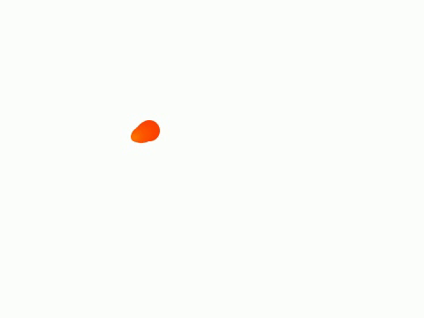

# MouseTrail.js

MouseTrail.js is a JavaScript library that creates a trailing effect of particles following the mouse cursor on a webpage.

### Demo

Check out the demo GIF below to see MouseTrail.js in action:



### Installation

To use MouseTrail.js, include the following script tag in your HTML file:

```html
<script type="text/javascript" src="mouseTrail.js"></script>
```
### Usage
MouseTrail.js provides an easy-to-use API to add mouse trailing particles to your webpage.

### Creating an instance
To create a MouseTrail instance, use the following code:
```javascript
const mouseTrail = new MouseTrail();
```
### Methods
MouseTrail.js provides two methods to control the visibility of the trail:

#### Show method
The `show()` method starts the animation and displays the particle trail.
```javascript
mouseTrail.show();
```
#### Hide method
The `hide()` method pauses the animation and hides the particle trail.
```javascript
mouseTrail.hide();
```

### Event Listeners
MouseTrail.js provides two event listeners:

#### Moving event
The `moving` event is fired when the mouse starts moving.

```javascript
mouseTrail.addEventListener('moving', () => {
  // Code to execute when the mouse starts moving
});
```

#### Stopped event
The `stopped` event is fired when the mouse stops moving.

```javascript
mouseTrail.addEventListener('stopped', () => {
  // Code to execute when the mouse stops moving
});
```

### Initial Values
The MouseTrail constructor also accepts the following optional initial values:

1. Initial Size (`number`) Specifies the initial size of the particles in pixels.

2. Initial Length (`number`) Specifies the initial length of the particle trail in number of particles.

3. Color Index (`number`) Specifies the initial color index (`hsl`) of the particles.

4. Motion Status (`boolean`) Specifies the initial motion status of the particles. true indicates that the particles should move, while false indicates that the particles should remain stationary.

```javascript
const mouseTrail = new MouseTrail(24, 15, 2, true);
```
### License
MouseTrail.js is released under the MIT License. See the LICENSE file for more details.